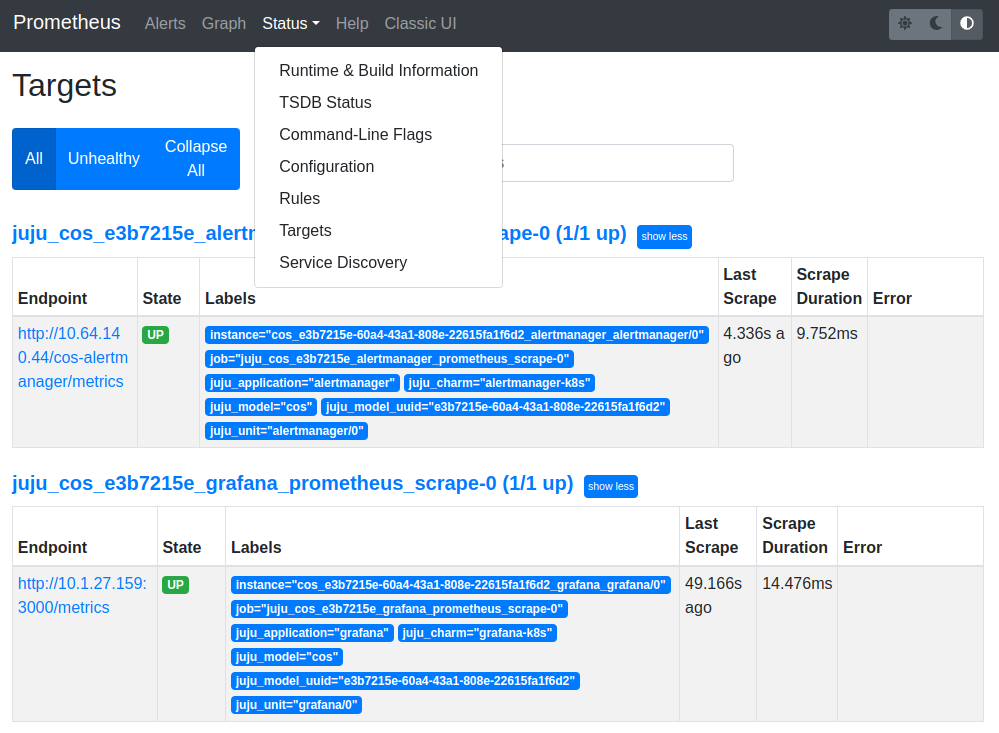
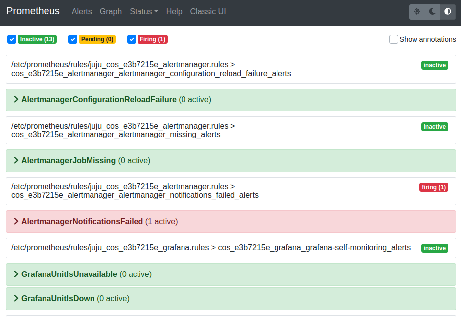
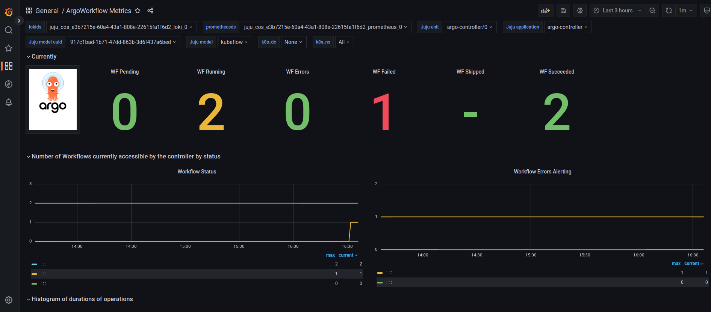
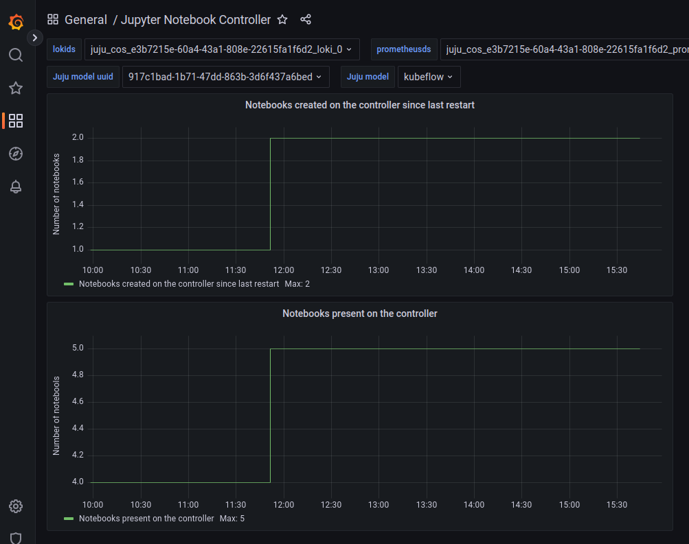
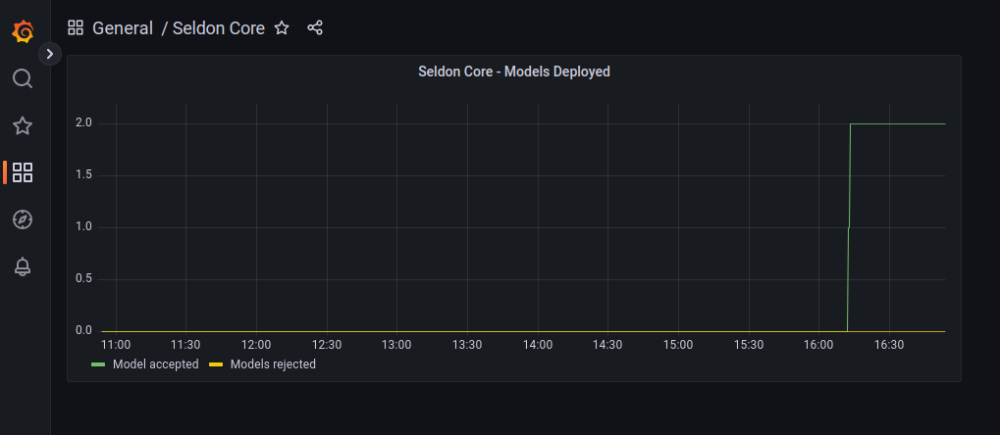

# Kubeflow and COS Integration

*Last verified: Feb 15, 2023*

*This file is generated based on `kubeflow-cos-integration.ipynb`*

## Contents

* [Overview](#overview)
* [Prerequisites](#prerequisites)
* [Instructions](#instructions)
  * [Prometheus integration](#prometheus-integration)
  * [Grafana integration](#grafana-integration)
  * [Access Prometheus metrics](#access-prometheus-metrics)
  * [Access Prometheus alerts](#access-prometheus-alerts)
    * [List of alerts per Kubeflow component](#list-of-alerts-per-kubeflow-component)
  * [Access Grafana dashboards](#access-grafana-dashboards)
    * [View metrics in ArgoWorkflow Metrics dashboard](#view-metrics-in-argoworkflow-metrics-dashboard)
    * [View metrics in Jupyter Notebook Controller dashboard](#view-metrics-in-jupyter-notebook-controller-dashboard)
    * [View metrics in Seldon Controller Manager dashboard](#view-metrics-in-seldon-controller-manager-dashboard)

## Overview

This guide intended to introduce end users to integration of Kubeflow and COS (Canonical Observability Stack)

For more detailed documentation on Kubeflow Pipelines refer to https://www.kubeflow.org/docs/components/pipelines/

This repository contains all artifacts needed to support this guide. `graphics/` directory contains all related screenshorts and diagrams. `resources/` directory contains all resources needed to generate this `README.md` and run automated documentation tests. Main documentation which this `README.md` is generated from is in `kubeflow-cos-integration.ipynb`.

## Prerequisites

- Deployed Kubeflow instance, and access to Kubeflow dashboard. For sample Kubeflow deployment refer to https://charmed-kubeflow.io/docs/get-started-with-charmed-kubeflow. More details on Kubeflow can be found here https://www.kubeflow.org/docs/.
- Deployed COS. For deployment of COS refer to https://charmhub.io/topics/canonical-observability-stack/tutorials/install-microk8s
- Familiarity with Python, Jupyter notebooks.
- Minimum system requirements: CPU 8 RAM 32GB DISK 120GB


## Instructions

After deploying Kubeflow and COS there will be two models on the controller - `kubeflow` containing Kubeflow deployment and `cos` containing COS deployment.
Integration with COS involves adding relations to Prometheus to have access to metrics and to Grafana to provide dashboards.
The following components provide built-in sample Grafana dashboards:
- Argo Controller
- Jupyter Notebook Controller
- Seldon Controller Manager

### Prometheus integration

To relate Kubeflow deployment with Prometheus in COS:


```python
juju switch kubeflow
juju add-relation argo-controller admin/cos.prometheus-scrape
juju add-relation dex-auth admin/cos.prometheus-scrape
juju add-relation katib-controller admin/cos.prometheus-scrape
juju add-relation kfp-api admin/cos.prometheus-scrape
juju add-relation metacontroller-operator admin/cos.prometheus-scrape
juju add-relation minio admin/cos.prometheus-scrape
juju add-relation seldon-controller-manager admin/cos.prometheus-scrape
juju add-relation training-operator admin/cos.prometheus-scrape
juju add-relation mlflow-server admin/cos.prometheus-scrape
juju add-relation jupyter-controller admin/cos.prometheus-scrape
```

### Grafana integration

To relate Kubeflow deployment with Grafana in COS:


```python
juju switch kubeflow
juju add-relation jupyter-controller admin/cos.grafana-dashboards
juju add-relation seldon-controller-manager admin/cos.grafana-dashboards
juju add-relation argo-controller admin/cos.grafana-dashboards
```

### Access Prometheus metrics

Follow COS documentation on how to access Prometheus metrics [Browse dashboards](https://charmhub.io/topics/canonical-observability-stack/tutorials/install-microk8s) section or obtain IP address using `juju show-unit` command:


```python
juju switch cos
PROMETHEUS_IP=$(juju show-unit prometheus/0 --format yaml | yq .prometheus/0.address)
curl "http://$PROMETHEUS_IP:9090"
```


Navigate to Promethues metrics URL, eg. `http://<prometheus-unit-ip>:9090`. Navigate to "Status"->"Targets" to see available metrics for various components that were related to Prometheus.

 

### Access Prometheus alerts

In order to see alerts available for Prometheus, throufh Prometheus metrics URL, navigate to "Alerts".



#### List of alerts per Kubeflow component

**Argo Workflows**
Alert | Expression and corresponding Argo Workflow metric | Severity
--- | --- | ---
ArgoWorkflowErrorLoglines | increase(log_messages{level="error"}[2m])  > 10 | Critical
ArgoWorkflowWarningLoglines | increase(log_messages{level="warning"}[2m]) > 40 | Warning
ArgoUnitIsUnavailable | up < 1 | Critical
ArgoWorkflowsErroring | increase( argo_workflows_count{status="Error"}[2m] ) > 1 | Warning
ArgoWorkflowsFailed | increase( argo_workflows_count{status="Failed"}[2m]) > 1 |Warning
ArgoWorkflowsPending | increase( argo_workflows_count{status="Pending"}[2m] ) > 1 | Warning

**Jupyter Notebook Controller**
Alert | Expression and corresponding Jupyter Notebook Controller metric | Severity
--- | --- | ---
UnfinishedWorkQueueAlert | rate(workqueue_unfinished_work_seconds[5m]) >= 100 | Critical
FileDescriptorsExhausted | process_open_fds / process_max_fds >= 0.98 | Critical
FileDescriptorsSoonToBeExhausted | predict_linear((process_open_fds / process_max_fds)[5m:], 60*60) >= 1 |High
JupyterControllerRuntimeReconciliationErrorsExceedThreshold | rate(controller_runtime_reconcile_errors_total[5m]) > 0 | Critical
JupyterControllerUnitIsUnavailable | up < 1| Critical

**Istio Pilot**
Alert | Expression and corresponding Istio Pilot metric | Severity
--- | --- | ---
IstioPilotAvailabilityDrop | avg(avg_over_time(up[1m])) < 0.5 for: 5m | Critical

**Seldon Controller Manager**

Alert | Expression and corresponding Seldon Core Operator metric | Severity
--- | --- | ---
SeldonWorkqueueTooManyRetries | rate(workqueue_retries_total[10m]) > 0 | Critical
SeldonHTTPError | rate(rest_client_requests_total{code=~"4.*"}[10m]) > 0 | Critical
SeldonReconcileError | rate(controller_runtime_reconcile_total{result="error"}[10m]) > 0 | Critical
SeldonUnfinishedWorkIncrease | rate(workqueue_unfinished_work_seconds[10m]) > 0| Critical
SeldonWebhookError | rate(controller_runtime_webhook_requests_total{code="5.*"}[10m]) > 0 | Critical
SeldonUnitIsUnavailable | up < 1 | Critical


### Access Grafana dashboards

Follow COS documentation on how to access Grafana dashboard [Brosed dashboards](https://charmhub.io/topics/canonical-observability-stack/tutorials/install-microk8s) section or obtain IP address using `juju show-unit` command:


```python
juju switch cos
GRAFANA_IP=$(juju show-unit grafana/0 --format yaml | yq .grafana/0.address)
curl -f -LI "http://$GRAFANA_IP:3000"
```


Navigate to Grafana dashboard URL, eg. `http://<grafana-unit-ip>:3000`

Browse available dashboards by navigating to "Dashboards"->"Browse". There should be the following dashboards available:
- ArgoWorkflow Metrics
- Jupyter Notebook Controller
- Seldon Core

#### View metrics in ArgoWorkflow Metrics dashboard

Navigate to "ArgoWorkflow Metrics" dashboard.
Locate Grafana filters at the top of the dashboard and select the following to see the metrics, if required:
- **Juju model** = `kubeflow`
- **Juju application** = `argo-controller`

The following metrics are provided (scroll down to see more graphs):
- Number of workflows in error state
- Number of workflows in failed state
- Number of workflows in pending state
- Number of workflows in running state
- Number of workflows in succeded state
- Graph of number of workflow currently accessible by controller
- Graph of number of workflow errors alerting
- Histogram of workflow operation duration (not execution time)
- Graph of number of workflow queue adds
- Graph of depth of work queue
- Graph of time objects spent in the queue
- Graph of number of log messages



#### View metrics in Jupyter Notebook Controller dashboard

Navigate to "Jupyter Notebook Controller" dashboard.
Locate Grafana filters at the top of the dashboard and select the following to see the metrics, if required:
- **Juju model** = `kubeflow`
- **Juju application** = `jupyter-controller`

The following metrics are provided:
- Graph of number of notebooks created on the controller since last restart.
- Graph of number of notebooks present on the controller.



#### View metrics in Seldon Controller Manager dashboard

Navigate to "Seldon Core" dashboard.
Locate Grafana filters at the top of the dashboard and select the following to see the metrics, if required:
- **Juju model** = `kubeflow`
- **Juju application** = `seldon-controller-manager`

The following metrics are provided and describe models deployed to Seldon Core:
- Graph of number of models rejected and accepted.


