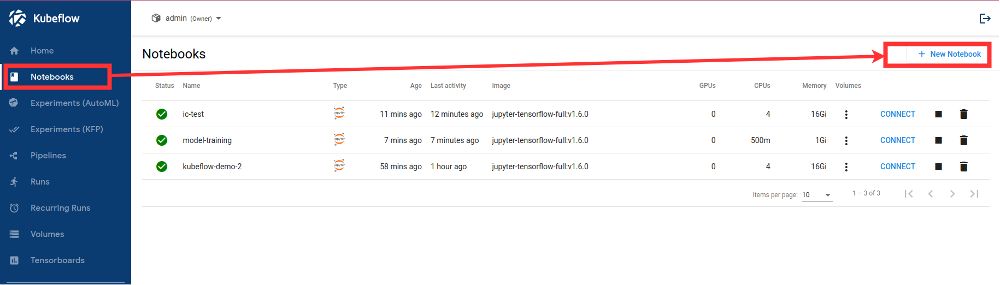
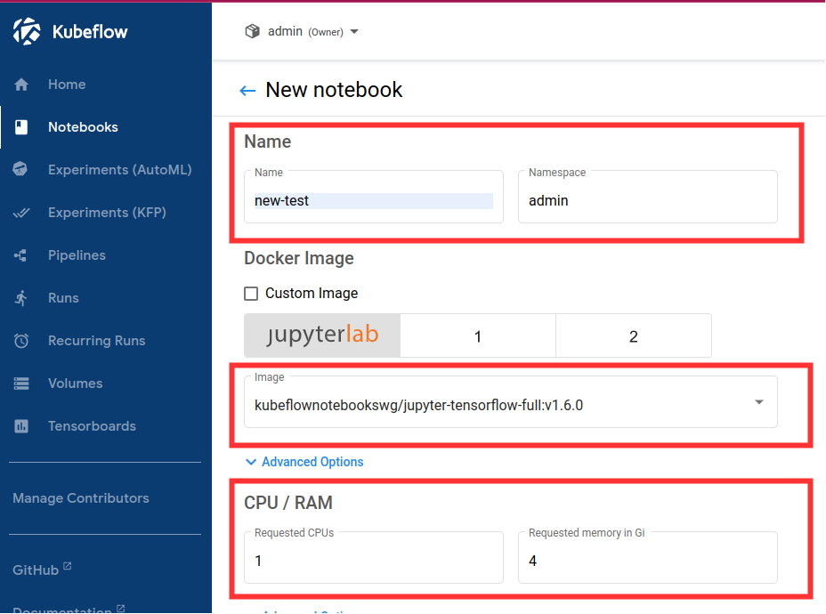

# ML Workflow Demo: Kubeflow - Katib - ML Flow

## Overview

This guide intended to introduce end users to complete ML workflow using Kubeflow. In particular, examples of Kubeflow pipeline using Katib hyperparameter tuning and ML Flow model registry are presented along with some common pipeline steps interfaces such as S3.

The following diagram outlines ML workflow presented in this guide. Major pipeline steps include:
- Ingestion of dataset.
- Cleaning up the dataset.
- Store of cleaned data to S3 bucket.
- Hyperparameter tuning using Katib and Tensorflow training container image (with ML Flow store functionality).
- Converting Katib results to streamlined format.
- Model training using tuning results.
- Storing the resulting production model to ML Flow model registry.


This repository contains all artifacts needed to support this guide. `images/` directory contains all related screenshorts and diagrams. `resources/` directory contains Jupyter notebook containing all steps in this guide, `Dockerfile` and Python script for training image used in this guide.

## Prerequisites

- Deployed Kubeflow instance and access to Kubeflow dashboard. For sample Kubeflow deployment refer to https://charmed-kubeflow.io/docs/quickstart
- Deployed MLFlow. For deployment of Charmed MLFlow refer to https://charmed-kubeflow.io/docs/mlflow
- Familiarity with Python, Docker, Jupyter notebooks.

## Instructions
The following are the instructions that outline the workflow process.

1. Access Kubeflow dashboard.

2. Navigate to Notebooks.

3. Create a new notebook.
  a. Fill in name
  b. Select Tensorflow image `jupyter-tensorflow-full:v1.6.0`
  c. Select minimum configuration: 4 CPUs and 16GB of RAM





4. Connect to the newly created notebook.

5. Create a Jupyter notebook to hold code that will specify the Kubeflow pipeline.


NOTE: The following Jupyter notebook contains all the steps outlined below: [ml-workflow-demo-kfp-katib-mlflow,ipynb](./(ml-workflow-demo-kfp-katib-mlflow,ipynb)

6. To setup environment add the following cells to the newly created Jupyter notebook:

```
!pip install kfp==1.8.12
!pip install kubeflow-katib==0.13.0

import json
import kfp
from kfp import dsl
from kfp import Client
from kfp import components
from kfp.onprem import use_k8s_secret
import numpy as np
import pandas as pd
from scipy.io.arff import loadarff
from kubeflow.katib import ApiClient
from kubeflow.katib import V1beta1ExperimentSpec
from kubeflow.katib import V1beta1AlgorithmSpec
from kubeflow.katib import V1beta1ObjectiveSpec
from kubeflow.katib import V1beta1ParameterSpec
from kubeflow.katib import V1beta1FeasibleSpace
from kubeflow.katib import V1beta1TrialTemplate
from kubeflow.katib import V1beta1TrialParameterSpec
```

7. Create a pipeline step that will do data ingestion and cleanup. Setup transfer of clean data to the next step.

```
# Data ingest operation.
# Output is in outputs['data']
ingest_data_op = components.load_component_from_url(
'https://raw.githubusercontent.com/kubeflow/pipelines/master/components/contrib/web/Download/component.yaml'
)
```
```
# Data clean up operation.
def clean_arff_data(
    bucket,
    key,
    input_file: components.InputPath(str)
) -> str:
    import pandas as pd
    import boto3
    import os
    from io import StringIO
    from scipy.io.arff import loadarff

    print(f"Loading input file {input_file}")

    # Convert to dataframe arff format.
    raw_data = loadarff(input_file)
    df_data = pd.DataFrame(raw_data[0].copy())
    print(f"Loaded data file of shape {df_data.shape}")

    # Convert target column to numeric.
    df_data.iloc[:, -1] = pd.get_dummies(df_data['CHURN']).iloc[:, 0]

    # Remove missing values.
    df_clean = df_data.dropna(axis=1)
    df_clean.loc[:,'CHURN']=pd.get_dummies(df_data['CHURN']).iloc[:, 0]

    # Get rid of non-numeric columns.
    df_clean = df_clean.select_dtypes(exclude='object')

    # Save results to S3
    csv_buffer = StringIO()
    df_clean.to_csv(csv_buffer)
    s3_resource = boto3.resource(
        's3',
        endpoint_url='http://minio.kubeflow.svc.cluster.local:9000',
        aws_access_key_id=os.getenv('AWS_ACCESS_KEY_ID'),
        aws_secret_access_key=os.getenv('AWS_SECRET_ACCESS_KEY')
    )
    s3_resouce.create_bucket(bucket)
    print(f"Saving CSV of shape {df_clean.shape} to s3")
    s3_resource.Object(bucket, key).put(Body=csv_buffer.getvalue())

    return "Done"
```

8. Create the next pipeline step that will do hyperparameter tuning using Katib and a training container image docker.io/misohu/kubeflow-training:latest. For more details on the training container image refer to Appendix A of this guide.

```
# Katib hyperparameter tuning operation.
def create_katib_experiment_op(experiment_name, experiment_namespace, bucket, key):
    # Trial count specification.
    max_trial_count = 5
    max_failed_trial_count = 3
    parallel_trial_count = 2

    # Objective specification.
    objective = V1beta1ObjectiveSpec(
        type="maximize",
        goal=0.95,
        objective_metric_name="accuracy"
    )

    # Algorithm specification.
    algorithm = V1beta1AlgorithmSpec(
        algorithm_name="random",
    )

    # Experiment search space.
    # In this example we tune the number of epochs.
    parameters = [
        V1beta1ParameterSpec(
            name="epochs",
            parameter_type="int",
            feasible_space=V1beta1FeasibleSpace(
                min="5",
                max="10"
            ),
        )
    ]
    # Experiment trial template.
    trial_spec = {
        "apiVersion": "kubeflow.org/v1",
        "kind": "TFJob",
        "spec": {
            "tfReplicaSpecs": {
                "Chief": {
                    "replicas": 1,
                    "restartPolicy": "OnFailure",
                    "template": {
                        "metadata": {
                            "annotations": {
                                "sidecar.istio.io/inject": "false"
                            }
                        },
                        "spec": {
                            "containers": [
                                {
                                    "name": "tensorflow",
                                    "image": "docker.io/misohu/kubeflow-training:latest",
                                    "command": [
                                        "python",
                                        "/opt/model.py",
                                        "--s3-storage=true",
                                        "--epochs=${trialParameters.epochs}",
                                        f"--bucket={bucket}",
                                        f"--bucket-key={key}",
                                    ],
                                    "envFrom": [
                                      {
                                        "secretRef": {
                                          "name": "mlpipeline-minio-artifact"
                                        }
                                      }
                                    ]
                                }
                            ]
                        }
                    }
                },
               "Worker": {
                    "replicas": 1,
                    "restartPolicy": "OnFailure",
                    "template": {
                        "metadata": {
                            "annotations": {
                                "sidecar.istio.io/inject": "false"
                            }
                        },
                        "spec": {
                            "containers": [
                                {
                                    "name": "tensorflow",
                                    "image": "docker.io/misohu/kubeflow-training:latest",
                                    "command": [
                                        "python",
                                        "/opt/model.py",
                                        f"--s3-storage=true",
                                        "--epochs=${trialParameters.epochs}",
                                        f"--bucket={bucket}",
                                        f"--bucket-key={key}",
                                    ],
                                    "envFrom": [
                                      {
                                        "secretRef": {
                                          "name": "mlpipeline-minio-artifact"
                                        }
                                      }
                                    ]
                                }
                            ]
                        }
                    }
                }
            }
        }
    }

    # Configure parameters for the Trial template.
    trial_template = V1beta1TrialTemplate(
        primary_container_name="tensorflow",
        trial_parameters=[
            V1beta1TrialParameterSpec(
                name="epochs",
                description="Learning rate for the training model",
                reference="epochs"
            )
        ],
        trial_spec=trial_spec
    )

    # Create an Experiment from the above parameters.
    experiment_spec = V1beta1ExperimentSpec(
        max_trial_count=max_trial_count,
        max_failed_trial_count=max_failed_trial_count,
        parallel_trial_count=parallel_trial_count,
        objective=objective,
        algorithm=algorithm,
        parameters=parameters,
        trial_template=trial_template
    )

    # Create the KFP operation for the Katib experiment.
    # Experiment spec should be serialized to a valid Kubernetes object.
    katib_experiment_launcher_op = components.load_component_from_url(
        "https://raw.githubusercontent.com/kubeflow/pipelines/master/components/kubeflow/katib-launcher/component.yaml")
    op = katib_experiment_launcher_op(
        experiment_name=experiment_name,
        experiment_namespace=experiment_namespace,
        experiment_spec=ApiClient().sanitize_for_serialization(experiment_spec),
        experiment_timeout_minutes=60,
        delete_finished_experiment=False)

    return op
```
```
# Convert Katib experiment hyperparameter results to arguments in string format.
def convert_katib_results(katib_results) -> str:
    import json
    import pprint
    katib_results_json = json.loads(katib_results)
    print("Katib hyperparameter tuning results:")
    pprint.pprint(katib_results_json)
    best_hps = []
    for pa in katib_results_json["currentOptimalTrial"]["parameterAssignments"]:
        if pa["name"] == "epochs":
            best_hps.append("--epochs=" + pa["value"])
    print("Best hyperparameters: {}".format(best_hps))
    return " ".join(best_hps)
```

9. Create the last step of the pipeline that will do model training using Tensorflow based on Katib tuning results.

```
# Tensorflow job operation.
def create_tfjob_op(tfjob_name, tfjob_namespace, model, bucket, key):
    tf_model = str(model)

    tfjob_chief_spec = {
        "replicas": 1,
        "restartPolicy": "OnFailure",
        "template": {
            "metadata": {
                "annotations": {
                    "sidecar.istio.io/inject": "false"
                }
            },
            "spec": {
                "containers": [
                    {
                        "name": "tensorflow",
                        "image": "docker.io/misohu/kubeflow-training:latest",
                        "command": [
                            "python",
                            "/opt/model.py",
                            "--s3-storage=true",
                            f"{tf_model}",
                            "--mlflow-model-name=ml-workflow-demo-model",
                            f"--bucket={bucket}",
                            f"--bucket-key={key}",
                        ],
                        "envFrom": [
                          {
                            "secretRef": {
                              "name": "mlpipeline-minio-artifact"
                            }
                          }
                        ]
                    }
                ]
            }
        }
    }
    tfjob_worker_spec = {
        "replicas": 1,
        "restartPolicy": "OnFailure",
        "template": {
            "metadata": {
                "annotations": {
                    "sidecar.istio.io/inject": "false"
                }
            },
            "spec": {
                "containers": [
                    {
                        "name": "tensorflow",
                        "image": "docker.io/misohu/kubeflow-training:latest",
                        "command": [
                            "python",
                            "/opt/model.py",
                            "--s3-storage=true",
                            f"{tf_model}",
                            f"--bucket={bucket}",
                            f"--bucket-key={key}",
                        ],
                        "envFrom": [
                          {
                            "secretRef": {
                              "name": "mlpipeline-minio-artifact"
                            }
                          }
                        ]
                    }
                ]
            }
        }
    }
    
    # Create the KFP task for the TFJob.
    tfjob_launcher_op = components.load_component_from_url(
"https://raw.githubusercontent.com/kubeflow/pipelines/master/components/kubeflow/launcher/component.yaml")
    op = tfjob_launcher_op(
        name=tfjob_name,
        namespace=tfjob_namespace,
        chief_spec=json.dumps(tfjob_chief_spec),
        worker_spec=json.dumps(tfjob_worker_spec),
        tfjob_timeout_minutes=60,
        delete_finished_tfjob=False)
    return op
```

10. Define a complete pipeline that consists of all steps created earlier. Note that the name of the pipeline must be uqinue. If there was previously defined a pipeline with the same name and within the same namespace either change the name of current pipeline or delete the older pipeline from the namespace.

```
name = "demo-pipeline"
namespace = "admin"
s3_bucket = "demo-dataset"
key = "data.csv"
dataset_url = "https://www.openml.org/data/download/53995/KDDCup09_churn.arff"

@dsl.pipeline(
    name = "ML Workflow in Kubeflow",
    description = "Demo pipeline"
)
def demo_pipeline(name=name, namespace=namespace):

    # Step 1: Download dataset.
    ingest_data_task = ingest_data_op(url=dataset_url)

    # Step 2: Clean up the dataset and store it in S3 bucket.
    clean_data_op = components.create_component_from_func(
            clean_arff_data,
            "clean_data.yaml",
            packages_to_install=["pandas==1.2.4", "scipy==1.7.0", "boto3"],
        )
    clean_data_task = (clean_data_op(
        s3_bucket,
        key,
        ingest_data_task.outputs['data']
    ).apply(use_k8s_secret(
        secret_name='mlpipeline-minio-artifact',
        k8s_secret_key_to_env={
            'accesskey': 'AWS_ACCESS_KEY_ID',
            'secretkey': 'AWS_SECRET_ACCESS_KEY',
        })))

    with dsl.Condition(clean_data_task.output == "Done"):
        # Step 3: Run hyperparameter tuning with Katib.
        katib_op = create_katib_experiment_op(name, namespace, s3_bucket, key)

        # Step 4: Convert Katib results produced by hyperparameter tuning to model.
        convert_katib_results_op = components.func_to_container_op(convert_katib_results)
        best_katib_model_op = convert_katib_results_op(katib_op.output)

        # Step 5: Run training with TFJob.
        tfjob_op = create_tfjob_op(name, namespace, best_katib_model_op.output, s3_bucket, key)
```

11. Execute pipeline.

```
kfp_client = Client()
run_id = kfp_client.create_run_from_pipeline_func(
        demo_pipeline,
        namespace=namespace,
        arguments={},
    ).run_id
print(f"Run ID: {run_id}")
```

12. Observe run details.


13. Verify that model is stored in MLFlow model registry.
