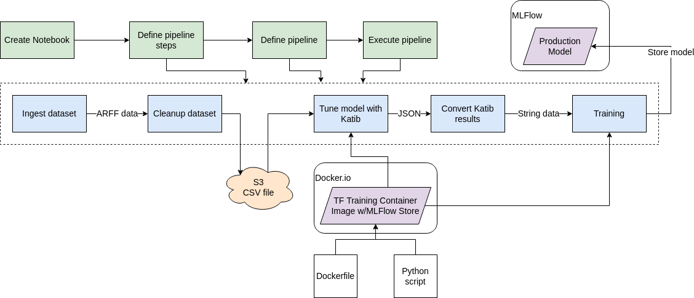
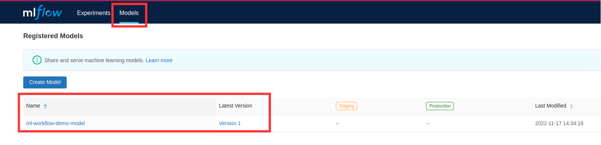

# ML Workflow Demo: Kubeflow - Katib - MLFlow

## Overview

This guide intended to introduce end users to complete ML workflow using Kubeflow. In particular, examples of Kubeflow Pipelines using Katib hyperparameter tuning and MLFlow model registry are presented along with some common pipeline steps and interfaces such as S3.

For more detailed documentation on Kubeflow Pipelines refer to https://www.kubeflow.org/docs/components/pipelines/

For more detailed documentation on Kubeflow Katib refer to https://www.kubeflow.org/docs/components/katib/

The following diagram outlines ML workflow presented in this guide. Major pipeline steps include:
- Ingestion of dataset.
- Cleaning up the dataset.
- Store of cleaned data to S3 bucket.
- Hyperparameter tuning using Katib and Tensorflow training container image (with MLFlow store functionality).
- Converting Katib tuning results to streamlined format.
- Model training using best parameters from tuning stage.
- Storing the resulting production model to MLFlow model registry.



This repository contains all artifacts needed to support this guide. `images/` directory contains all related screenshorts and diagrams. `resources/` directory contains Jupyter notebook containing all steps in this guide, `Dockerfile` and Python script for training image used in this guide.

## Prerequisites

- Deployed Kubeflow instance including Katib, and access to Kubeflow dashboard. For sample Kubeflow deployment refer to https://charmed-kubeflow.io/docs/quickstart (Note that the `kubeflow-lite` bundle does not include Katib. Use `juju deploy kubeflow --trust` instead when you get to that step). More details on Kubeflow can be found here https://www.kubeflow.org/docs/.
- Deployed MLFlow. For deployment of Charmed MLFlow refer to https://charmed-kubeflow.io/docs/mlflow
- Familiarity with Python, Docker, Jupyter notebooks.

## Instructions
The following are the instructions that outline the workflow process.

1. Access Kubeflow dashboard via URL, eg http://10.64.140.43.nip.io/

2. Navigate to Notebooks.

3. Create a new notebook.
    1. Fill in name
    2. Select Tensorflow image `jupyter-tensorflow-full:v1.6.0`
    3. Select minimum configuration: 1 CPU and 4GB of RAM


4. Connect to the newly created notebook.

5. Create a Jupyter notebook to hold code that will specify the Kubeflow pipeline.


NOTE: The following Jupyter notebook contains all the steps outlined below: [https://github.com/canonical/kubeflow-examples/ml-workflow-demo-kfp-katib-mlflow/ml-workflow-demo-kfp-katib-mlflow.ipynb](./ml-workflow-demo-kfp-katib-mlflow.ipynb)

6. To setup environment add the following cells to the newly created Jupyter notebook:


```python
!pip install kfp==1.8.12
!pip install kubeflow-katib==0.13.0

import json
import kfp
from kfp import dsl
from kfp import Client
from kfp import components
from kfp.onprem import use_k8s_secret
import numpy as np
import pandas as pd
from scipy.io.arff import loadarff
from kubeflow.katib import ApiClient
from kubeflow.katib import V1beta1ExperimentSpec
from kubeflow.katib import V1beta1AlgorithmSpec
from kubeflow.katib import V1beta1ObjectiveSpec
from kubeflow.katib import V1beta1ParameterSpec
from kubeflow.katib import V1beta1FeasibleSpace
from kubeflow.katib import V1beta1TrialTemplate
from kubeflow.katib import V1beta1TrialParameterSpec
```

7. Create pipeline steps that will do data ingestion and cleanup. Setup transfer of clean data to the next step using S3 bucket.

NOTE: Ingesting and cleaning of input data in this guide is an example of how data can be processed in the pipeline. Different data ingest, data cleaning, data formats can be integrated.

To load raw data into the pipeline use Kubeflow Pipelines component [reusable web downloader component](https://github.com/kubeflow/pipelines/blob/master/components/contrib/web/Download/component.yaml) to create data ingerst operation.


```python
# Data ingest operation.
# Output is in outputs['data']
ingest_data_op = components.load_component_from_url(
'https://raw.githubusercontent.com/kubeflow/pipelines/master/components/contrib/web/Download/component.yaml'
)
```

The data in this example is in ARFF format. Create function that will do cleanup of ingested data. In this example this function relies on specific components to aid in data processing. They are specified as packages and imports in the function code and cleanup data operation. Note that S3 bucket is used as output for cleaned data.


```python
# Data clean up operation.
# Output is in S3 (specified by `bucket`)
def clean_arff_data(
    bucket,
    key,
    input_file: components.InputPath(str)
) -> str:
    import pandas as pd
    import boto3
    import os
    from io import StringIO
    from scipy.io.arff import loadarff

    print(f"Loading input file {input_file}")

    # Convert to dataframe arff format.
    raw_data = loadarff(input_file)
    df_data = pd.DataFrame(raw_data[0].copy())
    print(f"Loaded data file of shape {df_data.shape}")

    print(f"Cleaning the data")
    # Convert target column to numeric.
    df_data.iloc[:, -1] = pd.get_dummies(df_data['CHURN']).iloc[:, 0]

    # Remove missing values.
    df_clean = df_data.dropna(axis=1)
    df_clean.loc[:,'CHURN'] = pd.get_dummies(df_data['CHURN']).iloc[:, 0]

    # Get rid of non-numeric columns.
    df_clean = df_clean.select_dtypes(exclude='object')

    print("Saving results to S3")
    csv_buffer = StringIO()
    df_clean.to_csv(csv_buffer)
    s3_resource = boto3.resource(
        's3',
        endpoint_url='http://minio.kubeflow.svc.cluster.local:9000',
        aws_access_key_id=os.getenv('AWS_ACCESS_KEY_ID'),
        aws_secret_access_key=os.getenv('AWS_SECRET_ACCESS_KEY')
    )
    check_bucket = s3_resource.Bucket(bucket)
    if not check_bucket.creation_date:
        # bucket does not exist, create it
        s3_resource.create_bucket(Bucket=bucket)
    print(f"Saving CSV of shape {df_clean.shape} to s3")
    s3_resource.Object(bucket, key).put(Body=csv_buffer.getvalue())

    return "Done"
```

Define data cleanup operation based on data clean up function.


```python
# Data cleanup operation.
# Output data is in S3.
clean_data_op = components.create_component_from_func(
        clean_arff_data,
        "clean_data.yaml",
        packages_to_install=["pandas==1.2.4", "scipy==1.7.0", "boto3"],
)
```

8. Create the next pipeline step that will do hyperparameter tuning using Katib and a training container image `docker.io/misohu/kubeflow-training:latest`. For more details on the training container image refer to [resources README](./resources/README.md) of this guide.

Note that output of Katib hyperparameter tuning is converted into `string` format by helper function `convert_katib_results()`.

Define Katib hyperparameter tuninig operation.


```python
# Katib hyperparameter tuning operation.
def create_katib_experiment_op(experiment_name, experiment_namespace, bucket, key):
    # Trial count specification.
    max_trial_count = 5
    max_failed_trial_count = 3
    parallel_trial_count = 2

    # Objective specification.
    objective = V1beta1ObjectiveSpec(
        type="maximize",
        goal=0.95,
        objective_metric_name="accuracy"
    )

    # Algorithm specification.
    algorithm = V1beta1AlgorithmSpec(
        algorithm_name="random",
    )

    # Experiment search space.
    # In this example we tune the number of epochs.
    parameters = [
        V1beta1ParameterSpec(
            name="epochs",
            parameter_type="int",
            feasible_space=V1beta1FeasibleSpace(
                min="5",
                max="10"
            ),
        )
    ]

    # Experiment trial template.
    trial_spec = {
        "apiVersion": "kubeflow.org/v1",
        "kind": "TFJob",
        "spec": {
            "tfReplicaSpecs": {
                "Chief": {
                    "replicas": 1,
                    "restartPolicy": "OnFailure",
                    "template": {
                        "metadata": {
                            "annotations": {
                                "sidecar.istio.io/inject": "false"
                            }
                        },
                        "spec": {
                            "containers": [
                                {
                                    "name": "tensorflow",
                                    "image": "docker.io/misohu/kubeflow-training:latest",
                                    "command": [
                                        "python",
                                        "/opt/model.py",
                                        "--s3-storage=true",
                                        "--epochs=${trialParameters.epochs}",
                                        f"--bucket={bucket}",
                                        f"--bucket-key={key}",
                                    ],
                                    "envFrom": [
                                      {
                                        "secretRef": {
                                          "name": "mlpipeline-minio-artifact"
                                        }
                                      }
                                    ]
                                }
                            ]
                        }
                    }
                },
               "Worker": {
                    "replicas": 1,
                    "restartPolicy": "OnFailure",
                    "template": {
                        "metadata": {
                            "annotations": {
                                "sidecar.istio.io/inject": "false"
                            }
                        },
                        "spec": {
                            "containers": [
                                {
                                    "name": "tensorflow",
                                    "image": "docker.io/misohu/kubeflow-training:latest",
                                    "command": [
                                        "python",
                                        "/opt/model.py",
                                        f"--s3-storage=true",
                                        "--epochs=${trialParameters.epochs}",
                                        f"--bucket={bucket}",
                                        f"--bucket-key={key}",
                                    ],
                                    "envFrom": [
                                      {
                                        "secretRef": {
                                          "name": "mlpipeline-minio-artifact"
                                        }
                                      }
                                    ]
                                }
                            ]
                        }
                    }
                }
            }
        }
    }

    # Configure parameters for the Trial template.
    trial_template = V1beta1TrialTemplate(
        primary_container_name="tensorflow",
        trial_parameters=[
            V1beta1TrialParameterSpec(
                name="epochs",
                description="Learning rate for the training model",
                reference="epochs"
            )
        ],
        trial_spec=trial_spec
    )

    # Create an Experiment from the above parameters.
    experiment_spec = V1beta1ExperimentSpec(
        max_trial_count=max_trial_count,
        max_failed_trial_count=max_failed_trial_count,
        parallel_trial_count=parallel_trial_count,
        objective=objective,
        algorithm=algorithm,
        parameters=parameters,
        trial_template=trial_template
    )

    # Create the KFP operation for the Katib experiment.
    # Experiment spec should be serialized to a valid Kubernetes object.
    katib_experiment_launcher_op = components.load_component_from_url(
        "https://raw.githubusercontent.com/kubeflow/pipelines/master/components/kubeflow/katib-launcher/component.yaml")
    op = katib_experiment_launcher_op(
        experiment_name=experiment_name,
        experiment_namespace=experiment_namespace,
        experiment_spec=ApiClient().sanitize_for_serialization(experiment_spec),
        experiment_timeout_minutes=60,
        delete_finished_experiment=False)

    return op
```

Define Katib convert results operation.


```python
# Convert Katib experiment hyperparameter results to arguments in string format.
def convert_katib_results(katib_results) -> str:
    import json
    import pprint
    katib_results_json = json.loads(katib_results)
    print("Katib hyperparameter tuning results:")
    pprint.pprint(katib_results_json)
    best_hps = []
    for pa in katib_results_json["currentOptimalTrial"]["parameterAssignments"]:
        if pa["name"] == "epochs":
            best_hps.append("--epochs=" + pa["value"])
    print("Best hyperparameters: {}".format(best_hps))
    return " ".join(best_hps)
```


```python
# Katib convert results operation.
convert_katib_results_op = components.func_to_container_op(convert_katib_results)
```

9. Create the last step of the pipeline that will do model training using Tensorflow based on Katib tuning results.


```python
# Tensorflow job operation.
def create_tfjob_op(tfjob_name, tfjob_namespace, model, bucket, key):
    tf_model = str(model)

    tfjob_chief_spec = {
        "replicas": 1,
        "restartPolicy": "OnFailure",
        "template": {
            "metadata": {
                "annotations": {
                    "sidecar.istio.io/inject": "false"
                }
            },
            "spec": {
                "containers": [
                    {
                        "name": "tensorflow",
                        "image": "docker.io/misohu/kubeflow-training:latest",
                        "command": [
                            "python",
                            "/opt/model.py",
                            "--s3-storage=true",
                            f"{tf_model}",
                            "--mlflow-model-name=ml-workflow-demo-model",
                            f"--bucket={bucket}",
                            f"--bucket-key={key}",
                        ],
                        "envFrom": [
                          {
                            "secretRef": {
                              "name": "mlpipeline-minio-artifact"
                            }
                          }
                        ]
                    }
                ]
            }
        }
    }
    tfjob_worker_spec = {
        "replicas": 1,
        "restartPolicy": "OnFailure",
        "template": {
            "metadata": {
                "annotations": {
                    "sidecar.istio.io/inject": "false"
                }
            },
            "spec": {
                "containers": [
                    {
                        "name": "tensorflow",
                        "image": "docker.io/misohu/kubeflow-training:latest",
                        "command": [
                            "python",
                            "/opt/model.py",
                            "--s3-storage=true",
                            f"{tf_model}",
                            f"--bucket={bucket}",
                            f"--bucket-key={key}",
                        ],
                        "envFrom": [
                          {
                            "secretRef": {
                              "name": "mlpipeline-minio-artifact"
                            }
                          }
                        ]
                    }
                ]
            }
        }
    }
    
    # Create the KFP task for the TFJob.
    tfjob_launcher_op = components.load_component_from_url(
"https://raw.githubusercontent.com/kubeflow/pipelines/master/components/kubeflow/launcher/component.yaml")
    op = tfjob_launcher_op(
        name=tfjob_name,
        namespace=tfjob_namespace,
        chief_spec=json.dumps(tfjob_chief_spec),
        worker_spec=json.dumps(tfjob_worker_spec),
        tfjob_timeout_minutes=60,
        delete_finished_tfjob=False)
    return op
```

10. Define a complete pipeline that consists of all steps created earlier. Note that the name of the pipeline must be unique. If there was previously defined pipeline with the same name and within the same namespace either change the name of current pipeline or delete the older pipeline from the namespace.


```python
demo_pipeline_name = "demo-pipeline"
namespace = "admin"
s3_bucket = "demo-dataset"
key = "data.csv"
dataset_url = "https://www.openml.org/data/download/53995/KDDCup09_churn.arff"

@dsl.pipeline(
    name = "ML Workflow in Kubeflow",
    description = "Demo pipeline"
)
def demo_pipeline(name=demo_pipeline_name, namepace=namespace):

    # Use the kfp.dsl.RUN_ID_PLACEHOLDER to get a unique name each time we execute this pipeline
    pipeline_name = f"{name}-{kfp.dsl.RUN_ID_PLACEHOLDER}"

    # Step 1: Download dataset.
    ingest_data_task = ingest_data_op(url=dataset_url)

    # Step 2: Clean up the dataset and store it in S3 bucket.
    # Note that we pass the `ingest_data_task.outputs['data']` as an argument here.  Because that output is
    # defined as a file path, Kubeflow Pipeline will copy the data from ingest_data_task to clean_data_task.
    clean_data_task = clean_data_op(
        s3_bucket,
        key,
        ingest_data_task.outputs['data']
    )

    # Because S3 access needs credentials, an extra directive is needed to pull those from an existing secret.
    clean_data_task.apply(use_k8s_secret(
        secret_name='mlpipeline-minio-artifact',
        k8s_secret_key_to_env={
            'accesskey': 'AWS_ACCESS_KEY_ID',
            'secretkey': 'AWS_SECRET_ACCESS_KEY',
        }
    ))

    # Wait for clean up data task to finish.
    with dsl.Condition(clean_data_task.output == "Done"):
        # Step 3: Run hyperparameter tuning with Katib.
        katib_task = create_katib_experiment_op(
            experiment_name=pipeline_name,
            experiment_namespace=namespace,
            bucket=s3_bucket,
            key=key
        )

        # Step 4: Convert Katib results produced by hyperparameter tuning to model.
        best_katib_model_task = convert_katib_results_op(katib_task.output)

        # Step 5: Run training with TFJob. Model will be stored into ML Flow model registry
        # (done inside container image).
        tfjob_op = create_tfjob_op(tfjob_name=pipeline_name,
                                   tfjob_namespace=namespace,
                                   model=best_katib_model_task.output,
                                   bucket=s3_bucket,
                                   key=key)
```

11. Execute pipeline.


```python
kfp_client = Client()
run_id = kfp_client.create_run_from_pipeline_func(
        demo_pipeline,
        namespace=namespace,
        arguments={},
    ).run_id
print(f"Run ID: {run_id}")
```

12. Observe run details by selecting **Run details** link.


14. When Katib experiment has started observe details of this experiment by selecting **Exeperiments (AutoML)** option on sidebar of Kubeflow dashboard.


13. Verify that model is stored in MLFlow model registry by navigating to MLFlow dashboard, eg. http://10.64.140.43.nip.io/mlflow/#/



14. Now model is ready to be deployed!
